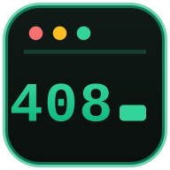

# 408Lab · 考研 408 刷题实验室

> 终端风格的考研 408（计算机学科专业基础综合）在线刷题站：近 20 年统考真题整卷还原 + 十套自创全真模拟卷 + 四科精选题库 + 全套经验笔记，**1636 道题目，每道单选的每一个选项都有独立讲解**，过程类题目配有可播放的动画演示。



## 题库规模

| 来源 | 数量 | 说明 |
| --- | --- | --- |
| 统考真题 | 846 题 | 2009–2026 共 18 套整卷，每套 40 单选 + 7 综合（满分 150 分结构） |
| 精选题库 | 320 题 | 数据结构 / 组成原理 / 操作系统 / 计算机网络 四科各 80 题，按考点配比精选 |
| 全真模拟卷 | 470 题 | 自创 10 套（每套 47 题，150 分），难度梯度从「基础过关」到「终极押题」 |
| **合计** | **1636 题** | 含图真题已文本化改编并标注 |

## 功能特性

- **题库浏览**：按科目 / 年份 / 题型 / 来源 / 难度多维筛选，全文搜索
- **刷题训练**：自定义题量与来源，逐题即时判定，键盘 `A`–`D` / `Enter` 快捷作答
- **模拟考试**：18 套真题整卷 + 10 套模拟卷整卷 + 智能随机组卷，180 分钟倒计时、答题卡涂卡式跳转、交卷判分、逐题复盘
- **逐选项讲解**：每道单选的 A/B/C/D 四个选项各有独立解析（正确项讲原理，错误项给精确错因）
- **动画讲解**：8 类可视化组件 —— 排序过程、树构造、图算法、页面置换、拥塞窗口演化、流水线时空图、协议时序、流程图，逐帧播放
- **错题本**：自动收录错题，重练 / 标记掌握
- **经验笔记**：6 大类 35 章（备考指南 + 四科知识体系 + 考情易错分析），章节与真题考频联动，一键跳转刷对应考点
- **数据统计**：GitHub 风格刷题热力图、科目正确率、年份覆盖、薄弱知识点排行、模考历史
- **账号与云同步**：注册 / 登录（Prisma + SQLite），做题记录、错题本、模考成绩云端同步；未登录数据保留在本地 localStorage
- **界面**：打字机问候语、悬浮抬升卡片、代码块复制闪烁、顶部阅读进度条、GitHub star/fork 实时计数、浅色 / 跟随系统 / 深色三态主题

## 技术栈

- **框架**：Next.js 16（App Router，单路由 SPA + hash 视图路由）、React 19、TypeScript
- **样式**：Tailwind CSS 4、shadcn/ui（Radix）、自研 emerald 终端绿主题（明暗双套）
- **状态**：Zustand（persist 本地持久化 + 云同步桥）
- **数据**：全部题目 / 笔记以 TypeScript 强类型数据文件内联（约 3.4MB 源码），零外部数据依赖
- **后端**：Next.js API Routes（注册 / 登录 / 会话 / 同步），Prisma ORM + SQLite

## 本地运行

```bash
# 安装依赖（推荐 bun，npm/yarn/pnpm 亦可）
bun install

# 初始化数据库（生成 db/custom.db）
bun run db:push

# 开发模式（http://localhost:3000）
bun dev

# 生产构建
bun run build
bun start
```

> 也可以直接从 [Releases](https://github.com/43aquarius/cs408/releases) 下载**单文件离线版**（一个 HTML，双击即用，无需安装任何东西；离线版不含账号云同步，做题记录保存在本地浏览器）。

## 目录结构

```
src/
├── app/                    # Next.js App Router（单路由 + API Routes）
│   ├── api/                # 注册 / 登录 / 登出 / 会话 / 云同步
│   └── page.tsx            # SPA 入口
├── components/
│   ├── views/              # 8 个视图：首页/题库/训练/模考/错题本/笔记/统计/关于
│   ├── visuals/            # 8 类动画讲解组件（树/图/排序/置换/流水线/时序…）
│   └── …                   # 题目卡片、代码块、主题切换、GitHub 计数等
├── data/
│   ├── questions/          # 2009–2026 真题（18 套 × 47 题）
│   ├── mocks/              # 10 套自创模拟卷（47 题/套）
│   ├── curated/            # 四科精选题库（80 题/科）
│   └── notes/              # 经验笔记（6 类 35 章）
├── lib/                    # Zustand store、认证、工具函数
└── scripts/                # 题库/笔记/模拟卷校验脚本（verify-*）
```

## 数据说明与免责声明

- 「真题」依据历年统考真题整理，含图题目做了文本化改编（标注 `adapted`）；「模拟卷」与「精选题库」为自创题目，命题风格对齐真题。
- 题库内容仅供个人备考学习使用，请在合理使用范围内传播；商用或大规模转载请自行评估版权风险。
- 部分题目由命题考点重构而来，若与原卷存在出入，以官方原卷为准，欢迎提 Issue 勘误。

## License

代码以 [MIT License](./LICENSE) 开源；题库与笔记内容仅供学习交流。
